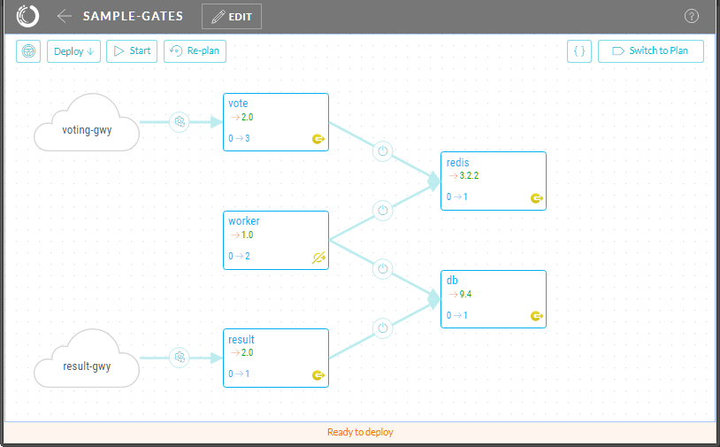

[](https://gitter.im/datagridsys/skopos?utm_source=badge&utm_medium=badge&utm_campaign=pr-badge&utm_content=badge)

Skopos Continuous Deployment System
==========================
[Skopos™](http://opsani.com/skopos/) is a modern continuous deployment system for container-based services, especially for DevOps teams and those using microservice architectures.

Below you can find a sample application and instructions for starting Skopos and deploying this sample app.  If you want to try out Skopos with your own app, check out our [Getting Started Guide](http://doc.opsani.com/skopos/edge/README/).

_Note: this sample application uses the Skopos "edge" release which has all the latest features and capabilities. The "edge" release is produced automatically from our latest development build which successfully passed the automated test suite. To start using the official beta release instead, see [Getting Started](http://doc.opsani.com/skopos/stable/README/) and the [tutorial app at github](https://github.com/opsani/skopos-sample-app)._

Skopos Sample Application
==========================
This Skopos sample application is a scalable variant of the Docker example Pet Voting Application which uses quality gates to validate its deployment.  [Quality gates](http://doc.opsani.com/skopos/edge/QUALITY-GATES/) attach user defined actions to components in order to *gate* the success of component deployment.

This sample application exposes two web interfaces - one that allows votes to be cast and one that shows results. This application deploys to Docker Swarm.



## Start Skopos Edge Release
Skopos consists of two components:

* the _Skopos engine_, packaged in a single container for simple installation
* the _Skopos control utility_, a command line utility `sks-ctl`, available for Linux, Mac OS and Windows. The utility may run on the same host where the Skopos engine runs or anywhere else with network access to that host.

To start the Skopos engine, run the following command on a swarm manager node:

```
docker run -d -p 8100:8100 --restart=unless-stopped --name skopos \
   -v /var/run/docker.sock:/var/run/docker.sock \
   opsani/skopos:edge
```

The command above starts the Skopos engine and expose its API and web-based user interface on port 8100 of the host. See [Starting Skopos](http://doc.opsani.com/skopos/edge/README/) for additional options, including enabling authentication.

To download the Skopos control utility on Linux:

```
wget https://s3.amazonaws.com/get-skopos/edge/linux/sks-ctl
chmod +x sks-ctl
sudo mv sks-ctl /usr/local/bin
```

Or download the control utility for [Mac OS X](https://s3.amazonaws.com/get-skopos/edge/darwin/sks-ctl) or [Windows](https://s3.amazonaws.com/get-skopos/egde/windows/sks-ctl.exe) and install it on the executable path.

## Deploy the Sample App

#### Load the Sample App
Use `sks-ctl` to load this sample application (add `--bind hostname:port` after `sks-ctl` if Skopos is not running locally on port 8100):

```
sks-ctl load --project sample-gates \
--env https://s3.amazonaws.com/qg-sample-app/env-swarm.yaml \
--env https://s3.amazonaws.com/qg-sample-app/env-quality-gates.yaml \
https://s3.amazonaws.com/qg-sample-app/model.yaml
```

This command loads the application model and environment descriptors directly from github.  Once the application is loaded, open the Skopos GUI in a browser:  the GUI is exposed on port 8100 of the host running the Skopos engine.

WIP =>
You can switch the to plan (icon in upper right corner) to view the generated plan for this particular deploy. The plan shows the top level of steps to be run (one for each component plus pre- and post- flight steps). The plan would take into consideration any dependencies between components and upgrade them in the correct order. Each of the top level steps can be expanded to view the set of steps that will be performed for each component. The outcome of each step can trigger either the next step (on success) or a rollback to the previous version (on failure).

Plan view in the Skopos UI to examine the deployment plan.  Click on any of the `db`, `redis`, `result` or `vote` components to zoom in to the component plan details.  Here you can see the injected quality gate step for that component.

Deploy the application using the UI controls.  If you follow the deployment in the Skopos Plan view UI, you can observe the deployment of each of these components is validated by its associated quality gate.

#### Deploy the Sample App

