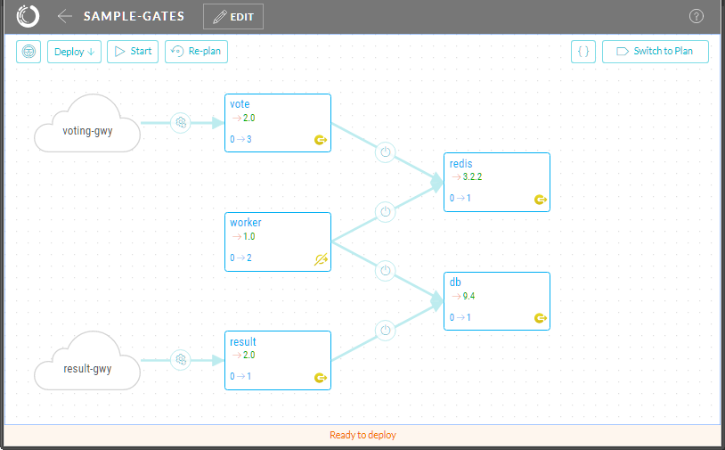
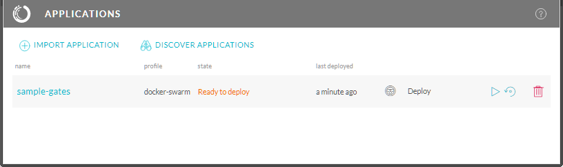
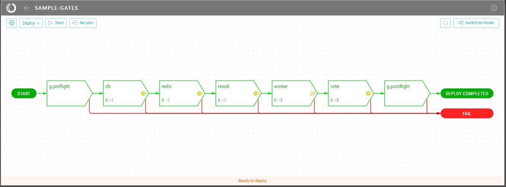
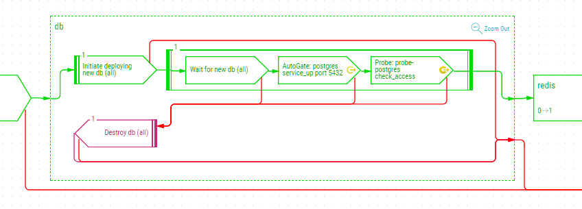

[](https://gitter.im/datagridsys/skopos?utm_source=badge&utm_medium=badge&utm_campaign=pr-badge&utm_content=badge)

Skopos Continuous Deployment System
==========================
[Skopos™](http://opsani.com/skopos/) is a modern continuous deployment system for container-based services, especially for DevOps teams and those using microservice architectures.

Below you can find a sample application and instructions for starting Skopos and deploying this sample app on Kubernetes.  If you want to try out Skopos with your own app, check out our [Getting Started Guide](http://doc.opsani.com/skopos/edge/GET-STARTED).

> _To deploy this sample app on Docker Swarm, see this [document](/README.md)._

Skopos Sample Application
==========================
This Skopos sample application is a scalable variant of the Docker example Pet Voting Application.  Notably, this application uses Skopos quality gates to validate its deployment.  [User defined quality gates](http://doc.opsani.com/skopos/edge/VERIFY-GUIDE#user-quality-gates) attach actions to components in order to *gate* the success of component deployment.  This application also demonstrates Skopos [automatic quality gates](http://doc.opsani.com/skopos/edge/VERIFY-GUIDE#autogates):  these are quality gates which Skopos automatically adds to deployment plans for components based on known images.

The sample application deploys to Kubernetes and exposes two web interfaces - one that allows votes to be cast and one that shows results.



## Start Skopos
Skopos consists of two components:

* The _Skopos engine_, packaged in a single container for simple installation
* The _Skopos control utility_ - a command line utility `skopos`, available for Linux, Mac OS and Windows. This utility may run on the same host where the Skopos engine runs or anywhere else with network access to that host.

To start Skopos on a Kubernetes cluster:

- download the following file: [`skopos-k8s.yaml`](http://doc.opsani.com/skopos/edge/skopos-k8s.yaml)
- run `kubectl apply -f skopos-k8s.yaml`

This command starts the Skopos engine and exposes its API and web-based user interface on a NodePort 32100 on your cluster. You can modify the `skopos-k8s.yaml` file to adjust the service type (e.g., load balancer), port number and specific Skopos image (`:edge` is the default).  See [Starting Skopos](http://doc.opsani.com/skopos/edge/INSTALL/) for additional options, including enabling authentication.

To download the Skopos control utility on Linux:

```
wget https://s3.amazonaws.com/get-skopos/edge/linux/skopos
chmod +x skopos
sudo mv skopos /usr/local/bin
```

Or download the control utility for [Mac OS X](https://s3.amazonaws.com/get-skopos/edge/darwin/skopos) or [Windows](https://s3.amazonaws.com/get-skopos/edge/windows/skopos.exe) and install it on the executable path.

## Deploy the Sample App

### Load the Sample App

The sample application is comprised of the following descriptors:

* [model.yaml](/model.yaml) - application model
* [env-k8s.yaml](/env-swarm.yaml) - basic [TED file](http://doc.opsani.com/skopos/edge/TED-GUIDE/) specifying core plugin and variables (e.g., port numbers, replicas)
* [env-quality-gates.yaml](/env-quality-gates.yaml) - TED file specifying user defined quality gates

Use the `skopos` utility to load the sample application (`<ip_address>` is an IP address of a Kubernetes node):

```
skopos --bind <ip_address>:32100 load --project sample-gates \
--env github://opsani/skopos-sample-gates/env-k8s.yaml \
--env github://opsani/skopos-sample-gates/env-quality-gates.yaml \
github://opsani/skopos-sample-gates/model.yaml
```

This command loads the application model and environment descriptors directly from github.  Once the application is loaded, open the Skopos GUI in a browser:  this UI is exposed on port 32100 of the host running the Skopos engine.

The UI displays the Skopos application list when first opened:



Mouse-click on the `sample-gates` application from the app list to open this application, displaying its model view.  This view shows the application components and gateways, connected according to their dependencies.

On application load, Skopos automatically generates a deployment plan.  When executed, this plan transforms the application from its current state to its target state (as specified in the app descriptors).  To view this plan in the UI, switch to the plan view (*Switch to Plan* icon in upper right corner):



The plan view shows the top level steps of the deployment plan, one for each component plus pre-flight and post-flight steps.  Components are ordered according to their dependencies for deployment.  Each of the top level steps can be expanded to view the detailed deployment plan for that component.  The outcome of each step triggers either the next step (on success) or a cleanup and rollback to the previous state (on failure).

### Quality Gates in the Sample App
One purpose of this sample app is to demonstrate user defined quality gates.  Quality gates associate deployment checks to one or more component images.  *During application deployment Skopos executes the specified checks to assess components deployed with matching images.*  

This sample app uses quality gates specified in the `env-quality-gates.yaml` descriptor:

```yaml
quality_gates:

    # check HTTP service is up
    http_default:
        images:
            - opsani/sample-result:*
            - opsani/sample-vote:*
        steps:
            - probe: opsani/probe-http

    # check access to redis
    redis:
        images:
            - redis:*
        steps:
            - probe:
                image: opsani/probe-redis
                action: check_access

    # check access to postgres
    postgres:
        images:
            - postgres:*
        steps:
            - probe:
                image: opsani/probe-postgres
                action: check_access
```

These checks are injected in the Skopos generated deployment plan for components deployed with matching images.  The quality gate checks are visible as steps in the Skopos UI plan view:  mouse-click on any of the `db`, `redis`, `result` or `vote` components to zoom-in the component plan details.  Here you can see the injected quality gate step(s) for that component.

For example, the `db` component includes two quality gates which use the Skopos [postgres probe](https://github.com/opsani/probe-postgres) to verify the postgres service is up and its API is accessible on the component's service network:

* *automatic quality gate*: Skopos includes an automatic quality gate for the `db` component because it is based on the official postgres image.  This gate verifies the postgres service is up on port 5432.  The *service_up* check will succeed if the postgres service is up, even if the connect response is authentication failure or invalid database.
* *user defined quality gate*:  this quality gate comes from the `env-quality-gates.yaml` TED file and verifies the postgres API is accessible on the component's service network using the probe default user, password and database (these are configurable).



A Skopos probe packages a service healthcheck as a container.  During application deployment, a probe is instantiated and attached to the service network of a target component.  From this position, the probe can verify the operation of the target service on the same network used to consume that service.  Skopos includes both generic probes for *tcp-connect* and *http* health-checks, as well as service specific probes for verifying service access in detail.  For more information, see [Skopos Probes](http://doc.opsani.com/skopos/edge/PROBES/)

### Deploy the Sample App

Deploy the application using the UI controls (*Start* icon to upper left).  If you follow the deployment progress in the Skopos Plan view, you can observe the deployment of each of the `db`, `redis`, `result` and `vote` components is validated by its associated quality gate(s).

The application can also be deployed using the Skopos CLI:

```
skopos --bind <ip_address>:32100 start --project sample-gates
```

After the deploy completes, the web interfaces exposed by the sample application are available at the gateway ports specified in the `env.swarm.yaml` environment descriptor:

* Vote: http://<ip_address>:30000/
* Result: http://<ip_address>:30001/

### Teardown the Sample App
To teardown the sample application using the Skopos UI:

* Mouse-click on the *Deploy* icon to the upper left and select *Teardown* from its drop-down menu.  This causes Skopos to generate a teardown plan for the application.
* Use the *Start* icon to execute the teardown plan.

## Next steps

Here are a few things you can try next:

- Set up [continuous deployment with Skopos Auto-Pilot or Jenkins CI/CD](http://doc.opsani.com/skopos/edge/CICD/)
- Add [chatops with Slack](http://doc.opsani.com/skopos/edge/CHATOPS/)
- See some of the [standard deployment environments](http://doc.opsani.com/skopos/edge/TED-GUIDE/#standard-target-environment-files) Skopos supports

... or just look at the full [Skopos Documentation](http://doc.opsani.com/skopos/edge/).

You can also reach out to us on [Gitter](https://gitter.im/opsani/skopos) or by [email](mailto:support@opsani.com).
